# 👋 Hi, I'm Alireza Saeedi

### Full-Stack Developer | AI Engineer | Systems Programmer

*Building innovative web applications and AI-powered solutions*

---

## 🚀 About Me

I'm a full-stack developer specializing in **scalable web platforms**, **e-commerce solutions**, and **AI-driven applications**. I focus on delivering clean, performant code with exceptional user experiences.

- 🎯 Building production-ready applications with modern tech stacks
- 🤖 Integrating AI/ML models into real-world applications
- ⚡ Performance-focused development with cutting-edge technologies
- 🌐 Creating seamless user experiences across all platforms

---

---

## 💻 Tech Stack

### Frontend Development

### Backend Development

### AI & Machine Learning

### Tools & Platforms

---

## 🎯 Featured Projects

### 🛫 [Air Parsiana - AI Flight Intelligence](https://airparsiana-2z0lve6cd-alirezasaeedis-projects.vercel.app/)

Revolutionary AI-powered flight intelligence system that predicts passenger needs and flight disruptions before they happen.

**Key Features:** 2-24 hour advance delay warnings • Personal travel assistant • Emotional intelligence communication • Real-time analytics

---

### 🛒 [Medusa E-Commerce Platform](https://marketplace-five-eta.vercel.app/us/)

Full-featured e-commerce storefront with headless commerce architecture, payment processing, and order management.

**Key Features:** Product catalog • Shopping cart • Stripe payments • User accounts • Order tracking

---

### 🎮 [WebAssembly Game Engine](https://gameengine-6zs1w75if-alirezasaeedis-projects.vercel.app/)

High-performance 2D game engine built from scratch with Rust and WebAssembly for browser-based games.

**Key Features:** WebGL 2.0 rendering • ECS architecture • Physics engine • Web Audio integration

---

### 📚 [Laitec Learning Platform](https://laitec-f08qnxmtq-alirezasaeedis-projects.vercel.app/)

Modern educational platform with full RTL support for Persian language courses and custom font integration.

**Key Features:** Course management • RTL support • Custom fonts • Responsive design

---

## 📫 Let's Connect

*Open to collaborations and exciting opportunities*

---

**⚡ Building the future, one commit at a time**

